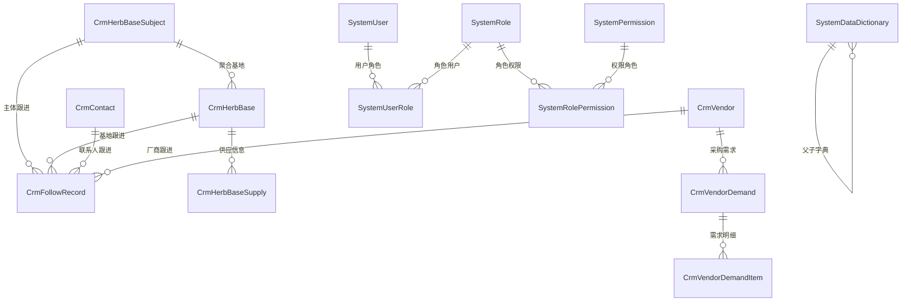

# QPS 实体说明

本文档基于后端领域实体整理，实体源码位于 `web-api/src/1.QPS.Domain/Entities`，EF Core 映射位于 `web-api/src/3.QPS.Infrastructure/Database/AppDbContext.cs`。

## 通用基类

所有领域实体继承 `BaseEntity`，默认包含以下公共字段：

| 字段 | 说明 |
| --- | --- |
| `Id` | 主键，`Guid`，构造时默认生成。 |
| `CreatedAt` / `CreatedBy` | 创建时间、创建人，由 `AppDbContext.SaveChanges` 自动维护。 |
| `UpdatedAt` / `UpdatedBy` | 更新时间、更新人，由 `AppDbContext.SaveChanges` 自动维护。 |
| `IsDeleted` | 软删除标记。所有继承 `BaseEntity` 的实体默认应用 `IsDeleted == false` 查询过滤器。 |

## CRM 实体

### CrmHerbBaseSubject 药材基地主体

用于聚合一个客户主体名下的多个药材基地，是基地客户跟进的主业务对象。

| 字段 | 说明 |
| --- | --- |
| `SubjectName` | 主体名称。创建时若为空，则使用基地名称兜底。 |
| `SubjectType` | 主体类型，默认 `UNKNOWN`。 |
| `OwnerUserId` | 负责人用户 ID。 |
| `Status` | 跟进状态，默认 `PENDING`，常见值包含 `PENDING`、`FOLLOWING`、`INTERESTED`。 |
| `Grade` | 主体等级。 |
| `Score` | 评分，用于排序或筛选。 |
| `PrimaryContactName` / `PrimaryContactPhone` | 主联系人姓名、电话。 |
| `LastFollowAt` / `LastFollowResult` / `NextFollowAt` | 最近跟进时间、结果、下次跟进时间。 |
| `Remark` | 备注。 |
| `HerbBases` | 该主体下的基地集合。 |
| `FollowRecords` | 该主体下的跟进记录集合。 |

主要行为：

| 方法 | 说明 |
| --- | --- |
| `Create` | 创建基地主体。 |
| `AssignOwner` | 分配负责人。 |
| `UpdateBasicInfo` | 更新主体基础信息。 |
| `UpdatePrimaryContact` / `ClearPrimaryContact` | 更新或清空主联系人。 |
| `UpdateFollowSummary` | 更新跟进摘要；若结果为 `INTERESTED` 或 `有意向`，状态更新为 `INTERESTED`；若原状态为 `PENDING`，则更新为 `FOLLOWING`。 |

### CrmHerbBase 药材基地

来源于清洗后的线索，用于具体药材基地管理。一个基地主体可以关联多个基地。基地本身维护位置、规模和来源等档案信息；可供量、规格、质量条件、供货周期和价格预期由关联的供应信息单独维护。

| 字段 | 说明 |
| --- | --- |
| `HerbBaseSubjectId` | 所属基地主体 ID，可为空。 |
| `BaseName` | 基地名称。 |
| `SubjectName` | 主体名称。 |
| `Grade` | 基地等级，例如 `A`、`B`、`C`、`INVALID`。 |
| `Score` | 线索评分。 |
| `Scale` | 种植规模，单位亩。 |
| `Province` / `City` / `Area` | 省、市、区县。 |
| `Address` | 详细地址。 |
| `Lat` / `Lng` | 纬度、经度。 |
| `SourcePlatform` | 来源平台，例如 `BAIDU_MAP`。 |
| `SourceId` | 来源表记录 ID，例如 `BaiduPoiHerbBase.Id`。 |
| `Status` | 处理状态，默认 `PENDING`，常见值包含 `PENDING`、`FOLLOWING`、`INTERESTED`、`DEAL`、`LOST`。 |
| `OwnerUserId` | 负责人用户 ID。 |
| `PrimaryContactName` / `PrimaryContactPhone` | 主联系人姓名、电话。 |
| `LastFollowAt` / `LastFollowResult` / `NextFollowAt` | 最近跟进摘要。 |
| `Remark` | 备注。 |

主要行为：

| 方法 | 说明 |
| --- | --- |
| `Create` | 创建基地，初始状态为 `PENDING`。 |
| `UpdateBasicInfo` | 更新基地基础信息、地区、坐标、规模和备注。 |
| `SetHerbBaseSubject` | 绑定或解绑基地主体。 |
| `AssignOwner` | 分配负责人。 |
| `UpdateSource` | 更新来源平台和来源 ID。 |
| `UpdateFollowSummary` | 更新跟进摘要，并按结果推进状态。 |
| `UpdateStatus` | 直接更新状态和备注。 |

EF 约束：

| 约束 | 说明 |
| --- | --- |
| `BaseName` / `SubjectName` | 最大长度 200。 |
| `Scale` | 精度 `18,2`。 |
| `Lat` / `Lng` | 精度 `10,6`。 |
| `CrmHerbBaseSubject` | 多个基地关联一个主体，删除行为为 `Restrict`。 |

### CrmHerbBaseSupply 基地供应信息

一条供应信息表示一个具体基地在一段有效期内可提供的某个中药材品类。`HerbBaseSubjectId` 是从具体基地同步的查询冗余字段，不能由客户端独立维护。

| 字段 | 说明 |
| --- | --- |
| `HerbBaseId` | 所属具体基地 ID。 |
| `HerbBaseSubjectId` | 所属基地主体 ID，可为空，由基地归属同步。 |
| `ProductName` | 供应品类，使用启用的中药材品类字典项。 |
| `AvailableQuantity` / `QuantityUnit` | 可供量及单位。 |
| `Specification` / `QualityRequirement` | 规格和质量要求。 |
| `HarvestSeason` / `SupplyCycle` | 产新期和供货周期。 |
| `ExpectedPrice` / `PriceUnit` | 预期价格及单位。 |
| `ConfirmedAt` / `ValidUntil` | 核实日期和有效截止日。 |
| `Status` | `待确认`、`有效`、`暂停`、`已售罄`、`已失效`。 |
| `Remark` | 备注。 |

主要行为：

| 方法 | 说明 |
| --- | --- |
| `Create` / `Update` | 创建或维护供应条件；已失效记录不可编辑。 |
| `ChangeStatus` | 转为有效时必须具备品类、可供量、单位、核实日期和有效截止日。 |
| `SyncHerbBaseSubject` | 基地变更归属时同步主体冗余字段。 |
| `IsEffectiveOn` | 判断有效供应信息在指定日期是否仍未过期。 |

### CrmContact 通用联系人

用于挂载到不同 CRM 业务实体上的联系人，目前通过 `EntityType + EntityId` 表达归属。

| 字段 | 说明 |
| --- | --- |
| `EntityType` | 所属业务实体类型，例如 `CRM_HERB_BASE_SUBJECT`、`CRM_VENDOR`。 |
| `EntityId` | 所属业务实体 ID。 |
| `ContactName` | 联系人姓名。 |
| `Phone` | 联系电话。 |
| `PhoneType` | 电话类型，例如 `MOBILE`、`LANDLINE`、`UNKNOWN`。 |
| `Wechat` | 微信号。 |
| `RoleName` | 联系人角色，例如负责人、采购、种植户。 |
| `IsPrimary` | 是否主联系人。 |
| `Status` | 联系人状态，默认 `UNVERIFIED`，常见值包含 `UNVERIFIED`、`VALID`、`INVALID`。 |
| `Remark` | 备注。 |
| `FollowRecords` | 联系人关联的跟进记录。 |

业务规则：

| 规则 | 说明 |
| --- | --- |
| 联系人姓名和电话 | 创建或更新时，`ContactName` 与 `Phone` 不能同时为空。 |
| 主联系人 | 可通过 `MarkPrimary` / `UnmarkPrimary` 设置。 |
| 状态 | 可通过 `MarkStatus` 更新状态和备注。 |

EF 约束：

| 约束 | 说明 |
| --- | --- |
| `EntityType` | 最大长度 64。 |
| `ContactName` | 最大长度 200。 |
| `Phone` | 最大长度 100。 |
| `PhoneType` | 最大长度 50。 |
| `Wechat` / `RoleName` | 最大长度 100。 |
| 索引 | `(EntityType, EntityId)`、`(EntityType, EntityId, Phone)`。 |

### CrmFollowRecord 客户跟进记录

通过 `EntityType + EntityId` 记录 CRM 业务对象的跟进行为。当前已用于基地主体和药企厂商，并可关联其联系人。

| 字段 | 说明 |
| --- | --- |
| `EntityType` | 跟进对象类型，当前主要为 `CRM_HERB_BASE_SUBJECT`、`CRM_VENDOR`。 |
| `EntityId` | 跟进对象 ID。 |
| `ContactId` | 跟进联系人 ID，可为空。 |
| `FollowType` | 跟进方式，例如电话、微信、拜访。 |
| `FollowResult` | 跟进结果。 |
| `IntentLevel` | 意向等级。 |
| `Content` | 跟进内容。 |
| `NextFollowAt` | 下次跟进时间。 |
| `OperatorUserId` | 跟进操作人用户 ID。 |

主要行为：

| 方法 | 说明 |
| --- | --- |
| `Create` | 创建跟进记录。 |
| `UpdateResult` | 更新结果、意向等级、内容和下次跟进时间。 |

跟进对象采用通用挂载，不为基地或厂商建立固定外键；`ContactId` 用于关联具体联系人。

### CrmBusinessEntityAttribute 业务实体扩展属性

为 CRM 业务实体提供可扩展属性，例如标签、资质等。

| 字段 | 说明 |
| --- | --- |
| `EntityType` | 业务实体类型。 |
| `EntityId` | 业务实体 ID。 |
| `AttributeCode` | 属性编码。 |
| `AttributeValue` | 属性值。 |
| `SortOrder` | 排序值。 |
| `Remark` | 备注。 |

EF 约束：

| 约束 | 说明 |
| --- | --- |
| 表名 | 显式映射为 `CrmBusinessEntityAttributes`。 |
| 索引 | `(EntityType, EntityId, AttributeCode)`、`(EntityType, EntityId, AttributeCode, AttributeValue)`。 |

### CrmTransferRecord 负责人转移记录

记录 CRM 业务实体负责人从一个用户转移到另一个用户的历史。

| 字段 | 说明 |
| --- | --- |
| `EntityType` | 被转移的业务实体类型。 |
| `EntityId` | 被转移的业务实体 ID。 |
| `FromOwnerUserId` | 原负责人用户 ID。 |
| `ToOwnerUserId` | 新负责人用户 ID。 |
| `OperatorUserId` | 操作人用户 ID。 |
| `Remark` | 备注。 |

EF 约束：

| 约束 | 说明 |
| --- | --- |
| `EntityType` | 最大长度 64。 |
| 索引 | `(EntityType, EntityId, CreatedAt)`。 |

### CrmVendor 药企厂商

承接药企求购线索，一家药企一行。

| 字段 | 说明 |
| --- | --- |
| `VendorName` | 厂商展示名称。 |
| `NormalizedVendorName` | 标准化厂商名称，用于去重。 |
| `PriorityLevel` | 优先级，例如 `High`、`Medium`、`Low`。 |
| `LatestPurchaseTime` | 最近采购时间。 |
| `LatestPurchaseDemandName` | 最近采购需求名称。 |
| `Remark` | 备注。 |
| `OwnerUserId` | 负责人用户 ID。 |
| `VendorDemands` | 厂商采购需求集合。 |

主要行为：

| 方法 | 说明 |
| --- | --- |
| `Create` | 创建厂商。 |
| `Update` | 更新厂商名称、标准化名称、优先级和备注。 |
| `UpdateLatestPurchaseDemandSummary` | 从采购需求刷新最近采购摘要。 |
| `ChangeOwner` | 变更负责人并产生流转记录。 |

EF 约束：

| 约束 | 说明 |
| --- | --- |
| `VendorName` / `NormalizedVendorName` | 最大长度 200。 |
| `PriorityLevel` | 最大长度 20。 |
| 唯一索引 | `NormalizedVendorName`。 |
| 普通索引 | `PriorityLevel`、`LatestPurchaseTime`。 |

### CrmVendorDemand 采购需求

采购需求是药企的结构化需求单，可来自外部抓取或人工录入。一张需求单包含多个采购需求明细；历史采购数据已整理为待确认采购需求。

| 字段 | 说明 |
| --- | --- |
| `VendorId` / `ContactId` | 所属厂商及可选联系人。 |
| `DemandNo` / `DemandName` / `DemandAt` | 需求编号、名称和提出日期。 |
| `Status` | `待确认`、`有效`、`匹配中`、`已完成`、`已关闭`。 |
| `SourceType` / `SourceUrl` | 来源类型和来源页面。 |
| `ExpectedDeliveryAt` / `ReceivingAddress` | 交期和收货地。 |
| `ClosedReason` / `Remark` | 关闭原因和备注。 |
| `Items` | 采购需求明细集合。 |

主要行为：

| 方法 | 说明 |
| --- | --- |
| `Create` / `Update` | 创建或更新需求及完整替换明细；已完成、已关闭不可编辑。 |
| `ChangeStatus` | 按状态机流转；转有效时全部明细必须具备品类、数量和单位，关闭必须填写原因。 |

### CrmVendorDemandItem 采购需求明细

每条明细维护一个品类的数量、规格、质量要求、目标价格、交期和排序。`IsValidForActivation` 用于校验转有效时品类、数量和单位是否齐全。

## 系统实体

### SystemUser 系统用户

| 字段 | 说明 |
| --- | --- |
| `RoleId` | 用户角色 ID。 |
| `Username` | 登录用户名。 |
| `PasswordHash` | 密码哈希。 |
| `RealName` | 真实姓名。 |
| `IsActive` | 是否启用。 |

主要行为：`Create` 创建用户，`Update` 更新姓名和角色，`ChangePassword` 修改密码，`Activate` / `Deactivate` 启用或停用用户。

### SystemRole 系统角色

| 字段 | 说明 |
| --- | --- |
| `Name` | 角色名称。 |
| `Code` | 角色编码。 |

主要行为：构造函数创建角色，`Update` 更新名称和编码。

### SystemPermission 系统权限

| 字段 | 说明 |
| --- | --- |
| `Name` | 权限名称。 |
| `Code` | 权限编码。 |
| `ParentId` | 父权限 ID，用于树形权限结构。 |

主要行为：构造函数创建权限，`Update` 更新名称、编码和父级。

### SystemUserRole 用户角色关系

| 字段 | 说明 |
| --- | --- |
| `UserId` | 用户 ID。 |
| `RoleId` | 角色 ID。 |

用于表达用户与角色的关联关系。

### SystemRolePermission 角色权限关系

| 字段 | 说明 |
| --- | --- |
| `RoleId` | 角色 ID。 |
| `PermissionId` | 权限 ID。 |

用于表达角色与权限的关联关系。

### SystemDataDictionary 数据字典

| 字段 | 说明 |
| --- | --- |
| `ParentId` | 父级字典 ID。 |
| `Code` | 字典编码。 |
| `Name` | 字典名称。 |
| `Value` | 字典值。 |
| `Description` | 描述。 |
| `SortOrder` | 排序值。 |
| `IsActive` | 是否启用。 |
| `Parent` / `Children` | 自关联父子结构。 |

主要行为：`Update` 更新字典内容，`RenameCode` 修改编码，`ToggleStatus` 切换启用状态。

### SystemChinaRegion 中国行政区划

当前区域页面与基地地区选择统一使用该实体；旧 `SystemRegion` 自定义区域模型已移除。

| 字段 | 说明 |
| --- | --- |
| `Code` | 行政区划编码。 |
| `Name` | 名称。 |
| `FullName` | 完整名称。 |
| `Level` | 层级。 |
| `ParentCode` | 父级编码。 |
| `ProvinceCode` | 省级编码。 |
| `CityCode` | 市级编码。 |
| `SortOrder` | 排序值。 |
| `IsActive` | 是否启用。 |

EF 约束：

| 约束 | 说明 |
| --- | --- |
| 索引 | `Code`、`(Level, ParentCode)`。 |
| 长度 | `Code`、`ParentCode`、`ProvinceCode`、`CityCode` 最大 20；`Name` 最大 100；`FullName` 最大 200。 |

### SystemOperationLog 操作日志

由 `AppDbContext` 在实体新增、修改、删除时自动生成，用于记录数据变更。

| 字段 | 说明 |
| --- | --- |
| `ActionType` | 操作类型：`Create`、`Update`、`Delete`。 |
| `EntityType` | 实体类型名称。 |
| `EntityId` | 实体 ID。 |
| `OperatorName` | 操作人。 |
| `RequestPath` | 请求路径。当前自动生成时为空。 |
| `IpAddress` | IP 地址。当前自动生成时为空。 |
| `ChangeJson` | 变更前后值 JSON。 |

EF 约束：

| 约束 | 说明 |
| --- | --- |
| 索引 | `CreatedAt`、`(EntityType, EntityId)`、`ActionType`。 |
| 长度 | `ActionType` 最大 64；`EntityType` 最大 128；`EntityId` 最大 64；`OperatorName` 最大 100；`RequestPath` 最大 500；`IpAddress` 最大 64。 |

### SystemErrorLog 错误日志

用于记录异常请求和错误上下文。

| 字段 | 说明 |
| --- | --- |
| `ErrorType` | 错误类型。 |
| `ErrorMessage` | 错误信息。 |
| `StackTrace` | 堆栈信息。 |
| `RequestUrl` | 请求地址。 |
| `RequestMethod` | 请求方法。 |
| `RequestBody` | 请求体。 |
| `UserId` / `Username` | 用户 ID、用户名。 |
| `IpAddress` | IP 地址。 |
| `UserAgent` | 浏览器或客户端标识。 |
| `HttpStatusCode` | HTTP 状态码。 |

## 主要关系

## 设计要点

| 要点 | 说明 |
| --- | --- |
| 软删除 | 所有 `BaseEntity` 默认受软删除过滤器约束，业务查询不会返回 `IsDeleted = true` 的记录。 |
| 审计字段 | 创建和更新时间、操作人由 `AppDbContext` 自动填充。 |
| 操作日志 | `SaveChanges` 时自动根据 EF 变更追踪生成 `SystemOperationLog`。 |
| CRM 通用挂载 | `CrmContact`、`CrmBusinessEntityAttribute`、`CrmTransferRecord` 通过 `EntityType + EntityId` 支持挂载到不同业务实体。 |
| 基地客户模型 | `CrmHerbBaseSubject` 表示客户主体，`CrmHerbBase` 表示具体基地，`CrmHerbBaseSupply` 表示可供条件。 |
| 厂商采购模型 | `CrmVendor` 表示药企厂商，`CrmVendorDemand` 及其明细表示结构化采购需求。 |
| 跟进模型 | `CrmFollowRecord` 通过 `EntityType + EntityId` 支持基地主体和厂商跟进。 |
